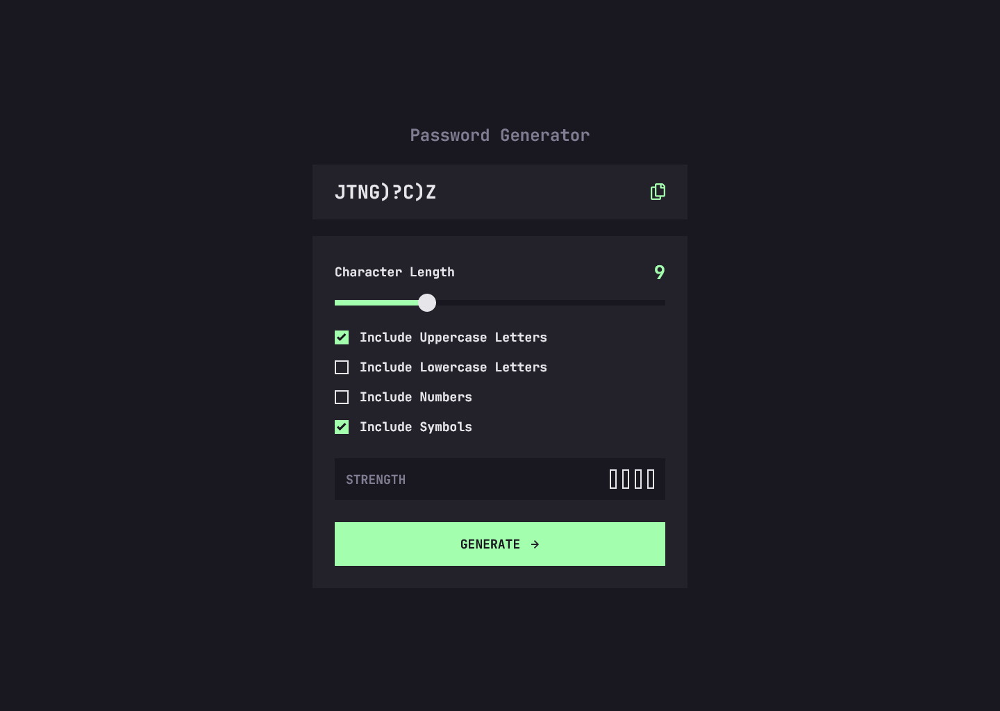

# Password Generator App

## Description

This is a simple web-based password generator application that allows users to customize the length and character set of their generated passwords. It also provides a visual password strength indicator and the ability to copy the generated password to the clipboard.

## Table of Contents

- [My Process](#my-process)
- [Built With](#built-with)
- [What I Learned](#what-i-learned)
- [Preview](#preview)
- [Live Demo](#live-demo)

## My Process

### Project Structure

- The project was structured as a simple web application with HTML, CSS, and JavaScript components.
- The HTML file (`index.html`) served as the foundation for the user interface and layout.
- CSS styles were organized in the `styles.css` file to ensure a visually appealing design.
- The JavaScript logic for password generation, interactivity, and password strength evaluation was implemented in the `script.js` file.

### Password Generation Logic

- The core of the application is the password generation logic in `script.js`.
- The `passGen` function generates passwords by considering user preferences such as character length and the inclusion of uppercase letters, lowercase letters, numbers, and symbols.
- It checks the state of checkboxes to determine which character sets to include in the final string.
- The generated password is then displayed on the web page.

Here's an overview of the key processes and functions within the script:

1. **Selecting Elements:** The script selects various elements from the HTML document using `document.getElementById` and `document.querySelector`.

2. **Password Generation:** The `passGen` function is responsible for generating passwords. It considers user-selected options and the desired password length to create a random password.

3. **Password Strength Assessment:** The `estimateStrength` function uses the `zxcvbn` library to evaluate the strength of generated passwords and update the UI with the assessment.

4. **Event Handling:** Event listeners are set up for the range input, the "Generate" button, and the "Copy" button. These listeners allow users to customize passwords, generate them, and copy them to the clipboard.

5. **Slider Styling:** The script includes styling for range inputs with the `slider-progress` class to ensure their appearance matches their value and range.

6. **Error Handling:** If no character type option is selected for password generation, an alert is shown to prompt the user to select at least one option.

### Styling and User Interface

- CSS in `styles.css` was used to style and structure the web page.
- Custom properties (CSS variables) were used to manage consistent color schemes throughout the application.
- The styling focused on creating an attractive and user-friendly interface, including visually appealing checkboxes, a password strength indicator, and a responsive design.

### Password Strength Indicator

- The application uses the `zxcvbn` library to estimate the strength of generated passwords.
- The `estimateStrength` function assesses the password's strength and updates the user interface to reflect the strength level (too weak, weak, medium, or strong).

### User Interaction

- Event listeners were set up to handle user interactions:
  - The "Generate" button triggers password generation and strength evaluation.
  - The "Copy" button allows users to copy the generated password to the clipboard.
  - The range input (slider) dynamically updates the character length for password generation.

### Responsive Design

- The application was designed to be responsive, adapting to different screen sizes and devices.
- Media queries and flexible layout techniques were used to ensure a consistent user experience across various devices.

### Documentation

- The README was created to provide a clear overview of the project, its purpose, technologies used, and key features.
- The README serves as a guide for users and potential contributors to understand and use the "Password Generator" app effectively.

## Built With

- HTML and CSS for the user interface.
- JavaScript for adding interactivity and functionality.
- The `zxcvbn` library for password strength assessment.

## What I Learned

While developing the `script.js` file for the Password Generator web application, I gained experience in the following areas:
- Styling range inputs (sliders) and checkboxes to improve user experience.
- Utilizing CSS custom properties (variables) to manage consistent styling.
- Selecting and manipulating DOM elements using JavaScript.
- Handling user interactions, including click events and input changes.
- Generating random passwords based on user preferences.
- Assessing password strength and providing feedback to users.
- Using third-party libraries, such as `zxcvbn`, to enhance functionality.

## Preview

## Live Demo

To experience the full functionality of the Password Generator app, you can visit the live demo by clicking [here](https://aachal01.github.io/password-generator-app/).
